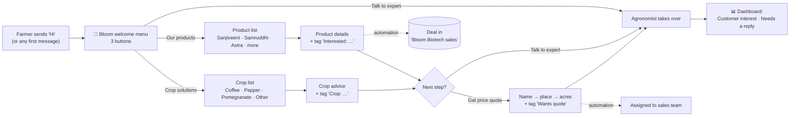

# Bloom Biotech × WhatsApp CRM — use cases & demo guide

This guide shows how the CRM runs WhatsApp sales and support for
**[Bloom Biotech](https://bloombiotech.netlify.app/)**, an agri-biotech company in
Chikkamagaluru (since 2013) that makes licensed microbial inputs with ICAR-IIHR:
**Bio Sanjiveeni**, **Bhu Samruddhi** and **Bio Astra**.

In one sentence: *a farmer messages Bloom on WhatsApp → the bot replies instantly as
Bloom Biotech, shows products and crop advice, and collects a price request → the
team sees the lead, what they're interested in, and a deal in the pipeline on the
dashboard.*

---

## 1. The customer journey

| Customer sends… | Bot does… | Team sees… |
|---|---|---|
| **Hi** / Hello / Namaskara / menu | Greets as Bloom Biotech with buttons: 🌿 Our products · 🌾 Crop solutions · 📞 Talk to expert | New contact, tagged **New lead** |
| **products** / price / order / a product name | Opens the product list directly | — |
| *taps* **Bio Astra** | Sends what it does, how it works, pack size, then offers a quote | Tag **Interested: Bio Astra** + a **"Bio Astra enquiry"** deal in the pipeline |
| *taps* **Coffee** | Sends the coffee recommendation (doses + no-tank-mix warning) | Tag **Crop: Coffee** |
| *taps* **💰 Get price quote** | Asks name, village/town and acres, then says an agronomist will call | Tag **Wants quote**, conversation assigned to sales, marked **Handed off**, answers saved as a note on the contact |
| **I want a dealership** / distributor / bulk | Asks name, business and area | Tag **Dealer enquiry** + a **"Dealer / bulk enquiry"** deal |
| *any other question* (e.g. "Can I mix Bio Astra with fungicide?") | If the AI assistant is on: answers from Bloom's product knowledge; otherwise waits for the team | Conversation in **Needs a reply** |

The bot never quotes prices, because Bloom quotes per crop and acreage. It collects
those details and hands the customer to a person.

---

## 2. One-time setup (about 5 minutes, no code)

1. **Connect WhatsApp**: *Settings → WhatsApp*. (Already connected on the demo account.)
2. **Install the kit**: open **Flows** (or **Automations**) → the **Bloom Biotech
   starter kit** card → **Set up in one click** → **Install**.
   This creates everything in section 4 and switches it on. Running it again is safe:
   anything that already exists by name is left alone.
3. **Set the currency to rupees**: *Settings → Deals & currency → INR*, so deal values show in ₹.
4. **Optional: turn on the AI assistant** so open-ended questions get answers:
   *AI agents → Setup* → add a provider API key → **Enable AI assistant** →
   **Auto-reply to inbound messages**. The kit has already loaded Bloom's product
   knowledge. If you set up AI *after* installing the kit, click **Add anything missing**
   on the kit card once, and it fills in Bloom's business prompt for the assistant.
5. **Optional: submit templates to Meta**: *Settings → Templates* → **Submit** on the
   Bloom templates you want. You only need these to message customers **first**
   (broadcasts, or follow-ups after 24 hours). Bot replies don't need them.

---

## 3. Live demo script (10 minutes)

Keep two screens open: **your phone (WhatsApp)** and the **CRM dashboard**.

**Step 1: "Hey, this is Bloom" (instant reply)**
Send `Hi` to the business number. The reply arrives within seconds:

> Hey there 👋 This is **Bloom Biotech** 🌱
> We make licensed microbial inputs with ICAR-IIHR — for healthier soil, stronger roots
> and better yields. Growing microbes in Chikkamagaluru since 2013.
> How can we help you today?
> `🌿 Our products` `🌾 Crop solutions` `📞 Talk to expert`

*Point out:* 24/7, instant, on-brand, and nobody on the team had to type anything.

**Step 2: Product interest**
Tap **🌿 Our products → Bio Astra**. The customer gets the product story. Now switch to the
**Dashboard**: the **Customer interest** panel shows your number with
**Interested: Bio Astra**, and **Pipelines → Bloom Biotech sales** has a new
**Bio Astra enquiry** card in *Interested*.

*Point out:* every tap becomes sales data automatically.

**Step 3: Crop advice**
Type `hi` again (typing a keyword always brings the menu back) → **🌾 Crop solutions →
Coffee**. The bot recommends Bio Sanjiveeni / Bhu Samruddhi / Bio Astra with doses
and the "never tank-mix" safety note. The contact is tagged **Crop: Coffee**.

*Point out:* this builds segments like "all coffee growers" for seasonal broadcasts.

**Step 4: Price request → hand-off to a human**
Tap **💰 Get price quote**, then answer the three questions (name, village, acres). Then:
- **Dashboard → Needs a reply** shows the conversation with a **Handed off** badge.
- **Inbox**: the conversation is assigned to the sales team, and the contact's notes
  say: *"💰 Price quote request — name: …, place: …, area: …"*.
- Reply from the inbox like a normal WhatsApp chat. Use the quick replies
  **Bloom · Dosage guide** or **Bloom · Contact details** to answer in one click.

*Point out:* the salesperson calls back with full context and never asks the farmer
the same questions twice.

**Step 5: Dealer lead**
Send `I want a dealership`. The bot asks name, business and area, creates a
**Dealer / bulk enquiry** deal and hands off.

**Step 6: Bring it together**
Show the **Dashboard**: Customer interest (top interests + latest leads), Needs a
reply, Pipeline by stage and Recent activity. Then show **Automations** and
**Flows**, and click into a flow to show that everything is editable, with no code.

**Bonus: AI answers** (if enabled): ask `Can I mix Bio Astra with fungicide?`. The
assistant answers from Bloom's knowledge (don't tank-mix; apply separately) and hands
off if it isn't sure.

---

## 4. What the kit sets up

### Flows (the WhatsApp bot)
| Flow | Starts when the customer says… | What it does |
|---|---|---|
| **Bloom · Dealer & bulk enquiry** | dealer, dealership, distributor, wholesale, bulk, stockist… | Collects name, business and area → tag → hand-off |
| **Bloom · Product enquiry** | products, price, rate, cost, buy, order, quote, sanjiveeni, samruddhi, astra, fertilizer… | Product list → details → quote / expert |
| **Bloom · Welcome menu** | hi, hello, hey, hai, namaste, namaskara, menu, bloom — **and any new customer's first message** | Welcome buttons → products / crops / expert |

Keywords match **whole words**, so "hi" fires on "Hi!" but not on "which". If a message
matches two flows, the more specific one wins: "hi, I want a dealership" goes to the
dealer flow.

### Automations (work in the background)
| Automation | When | Does |
|---|---|---|
| Tag new WhatsApp leads | a contact's first message | tag **New lead** |
| Bio Sanjiveeni / Bhu Samruddhi / Bio Astra enquiry → sales pipeline | the product tag is added | creates a deal in **Interested** |
| Price quote → assign to sales | **Wants quote** is tagged | assigns the conversation to the team |
| Dealer enquiry → sales pipeline | **Dealer enquiry** is tagged | creates a deal in **New enquiry** and assigns it |
| Next-day quote follow-up *(off by default)* | **Wants quote** is tagged | waits 20 h, then sends a friendly check-in |

### Everything else
- **Tags (10):** New lead · Interested: Bio Sanjiveeni / Bhu Samruddhi / Bio Astra ·
  Wants quote · Asked for expert · Dealer enquiry · Crop: Coffee / Black pepper / Pomegranate
- **Pipeline "Bloom Biotech sales":** New enquiry → Interested → Quote sent → Negotiation → Order won
- **Message templates (drafts):** bloom_welcome, bloom_season_reminder,
  bloom_enquiry_followup, bloom_order_confirmed. Templates with these names that
  you already have are kept as they are.
- **AI knowledge (4 docs):** company & contact, products, how to apply & safety,
  solutions by crop, all taken from bloombiotech.netlify.app.
- **Quick replies (4):** Contact details · Dosage guide · Tank-mix warning · Ask for crop and acreage

---

## 5. How this helps Bloom Biotech

| Problem today | With the CRM |
|---|---|
| Farmers message at night or during field hours, and replies come late | Instant, on-brand reply 24/7, so no enquiry goes cold |
| The same questions again and again (dose, mixing, which product) | Bot and AI answer from Bloom's own product facts |
| Enquiries are lost in personal phones | Shared inbox; every chat, note and deal lives in one place for the whole team |
| No idea which product or crop is in demand | **Customer interest** shows top interests and the latest leads this month |
| Sales follow-up depends on memory | Each enquiry becomes a deal in the pipeline, assigned to someone, with the farmer's answers attached |
| Dealer leads mixed with farmer queries | Dealer enquiries are routed, tagged and tracked separately |
| Seasonal campaigns are manual | Broadcast approved templates to segments like *Crop: Coffee* or *Interested: Bio Astra* |

**Use cases by team**
- **Sales:** pipeline of product and dealer enquiries; quote requests arrive with name, place and acreage.
- **Agronomy / support:** hand-offs with context, one-click dosage and safety replies, and AI for the routine questions.
- **Marketing:** crop and product segments for seasonal advisories, re-order reminders and new-stock alerts (via templates).
- **Owner:** one dashboard for enquiries, interest trends, response times and pipeline value.

---

## 6. Changing things yourself (no code)

- **Edit a bot message:** *Flows → open the flow → click a node → edit the text → Save*.
- **Add a product:** open the **Product list** node and add a row, then add a
  **Send message** node for its details and a **Tag contact** node for its tag.
- **Change trigger words:** *Flows → open the flow → Trigger → Keywords*. "How keywords match" is
  set to **As a whole word (recommended)**.
- **Write a WhatsApp template:** *Settings → Templates → New template*. Pick an example
  (Welcome, Order confirmed, Payment reminder…) or type your own, tap **+ Customer name**,
  **+ Product** and so on to add personal details, and check the **Preview** on the right.
  You no longer type `order_confirmation`-style names, language codes or `{{1}}` by hand.
  The editor handles those for you.

---

## 7. Good to know

- **The 24-hour rule:** WhatsApp lets the bot and team reply freely for 24 hours after
  the customer's last message. To message someone **first** (broadcasts, or follow-ups
  after 24 hours), use an **approved template**.
- **Old demo flows:** the account also has a generic **"Welcome menu"** flow (draft).
  Leave it as a draft, or delete it, so it doesn't compete with the Bloom flows for "hi".
- **Timed follow-ups:** the *Next-day quote follow-up* automation needs the automations
  cron job to run (the `/api/automations/cron` endpoint with `AUTOMATION_CRON_SECRET`).
  It's off by default for that reason.
- **Nothing replies to "Hi"?** Check that the three Bloom flows are **Active** on the Flows
  page and that *Settings → WhatsApp* shows **Connected**.

---

## 8. What was changed in the app for this

- **One-click starter kits** (`src/lib/kits/`): the Bloom kit and a safe, re-runnable
  installer, with a card on the Flows and Automations pages.
- **Flow triggers:** whole-word keyword matching; "also start for a new customer's first
  message"; typing a keyword while the bot is waiting on a button restarts that flow.
- **Hand-offs:** the flow's hand-off note fills in the customer's answers and is saved
  on the contact, so it shows in the inbox.
- **Dashboard:** new **Customer interest** panel. **Needs a reply** now includes
  conversations the bot handed off.
- **Simpler template editor:** examples, plain names, language by name, category
  descriptions, one-tap personal details and a live WhatsApp preview.
- **Flow builder fixes:** dropdowns show readable labels instead of internal values, and
  the tag picker works (before, it asked for a raw tag ID).
